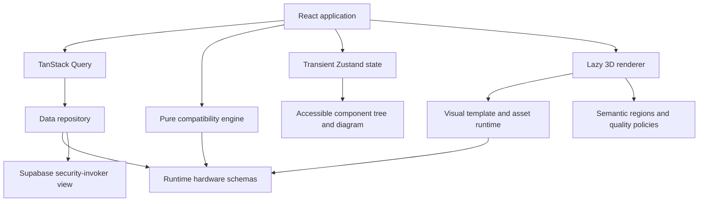

# Architecture

The hardware record is technical truth. A visual template receives validated configuration and renders an illustrative shape. Stable semantic identifiers connect geometry, component descriptors, selection, inspector and fallback diagram.

There are no domain-to-React dependencies. The engine's default entry exports lightweight policies/descriptors; `/renderer` owns Three.js and R3F. `/glb-loader` is a separate asset runtime entry and is not loaded for the procedural fixture. The optional Supabase adapter is dynamically imported only when configured. Browser state never owns catalog records; query caching is independent from selection state.

The repository exposes bounded pages (default 20, maximum 100), category filters, cursor IDs and exact record retrieval. The foundation UI renders the first page of the small fixture set. Server-side search, load-more UI and detail-by-slug lookup are later catalog work; the interface already prevents unbounded remote requests. The database's category/ID index supports stable cursor retrieval.

Camera focus uses semantic coordinates rather than generated mesh names. Template space is millimetres; geometry is converted to metres at the renderer boundary. Domain types do not depend on Three.js vectors. New templates must provide the same semantic anchors or a validated explicit mapping. Future installation/explosion transforms operate on those anchors, independently of specifications.

R3F owns procedural JSX geometry and materials, including instanced decorations. Imported content is owned by reference-counted runtime leases; the last release disposes geometry/material/texture resources. Decoder workers are released after all leases are closed. A consumer that aborts after acquiring a lease must still call release; consumers must not mutate a shared cached scene without cloning its instance. Persistent browser asset caching and byte-estimate instrumentation are not implemented yet.

WebGL 2 is the only graphics baseline. Renderer creation and module loading sit inside an error boundary; context-loss events leave 3D and activate the diagram. Data errors remain separate and offer data retry. WebGPU can be a second renderer adapter later without changing schema, compatibility or UI state. Known provenance/compatibility unknowns are visible text, never implicit green approval.

The shell uses a minimal hash route, appropriate for a static first pass and shareable explorer slugs. A larger catalog can replace routing without changing package contracts. No unused UI/shared/testing packages exist: tokens and icons currently belong to the application.
