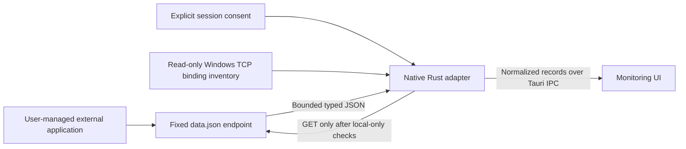

# External temperature sources: research and implementation

Research date: **9 October 2026, Asia/Amman**. Status: experimental, mock-tested integration. No universal compatibility, freeze prevention, live hardware validation or production-readiness claim is made.

## Source comparison and licensing

| Source                                                | Coverage and maintenance evidence                                                                                                  | License / redistribution assessment                                                                                                                                                            | Decision                                                                                                                                     |
| ----------------------------------------------------- | ---------------------------------------------------------------------------------------------------------------------------------- | ---------------------------------------------------------------------------------------------------------------------------------------------------------------------------------------------- | -------------------------------------------------------------------------------------------------------------------------------------------- |
| LibreHardwareMonitor external application             | Broad CPU, GPU, board and storage coverage; current upstream and v0.9.6 release. DIMM temperatures depend on real thermal sensors. | MPL 2.0 plus third-party terms. Commercial use is permitted subject to applicable obligations. Separate, user-managed installation avoids bundling its code, binaries or drivers in Cortex.    | Preferred protocol source; strict local-only verification can refuse official Windows builds.                                                |
| Independently packaged LibreHardwareMonitorLib helper | Same hardware engine; maintained .NET library.                                                                                     | Same MPL and artifact-specific dependency audit. Packaging a helper does not remove driver or hardware risks.                                                                                  | Evaluated below; no helper implemented, integrated or executed.                                                                              |
| smartmontools / smartctl                              | Maintained upstream; Windows support; physical ATA/SATA, SCSI/SAS and NVMe storage only.                                           | GPL v2 permits commercial use and redistribution with source/license obligations. Verify individual file terms and bundled components for an exact release.                                    | Suitable licensed storage candidate, but would introduce device commands and cannot meet broad coverage alone. No invocation or integration. |
| HWiNFO / SDK                                          | Maintained Windows monitoring product with broad coverage.                                                                         | Proprietary. Commercial use requires an appropriate commercial Pro license; SDK is a separate licensed product. An end-user Pro license does not authorize embedding or redistributing an SDK. | Excluded from the open redistribution shortlist pending a negotiated SDK agreement.                                                          |
| Open Hardware Monitor                                 | Broad older hardware support. Official latest release is 0.9.6 from December 2020.                                                 | MPL 2.0; commercial use is possible under its obligations and dependency terms.                                                                                                                | Maintenance evidence is insufficient for a new cross-PC integration.                                                                         |

Primary sources: [LibreHardwareMonitor repository](https://github.com/LibreHardwareMonitor/LibreHardwareMonitor), [releases](https://github.com/LibreHardwareMonitor/LibreHardwareMonitor/releases), [DIMM implementation](https://github.com/LibreHardwareMonitor/LibreHardwareMonitor/blob/v0.9.6/LibreHardwareMonitorLib/Hardware/Memory/DimmMemory.cs), [smartmontools upstream and license](https://github.com/smartmontools/smartmontools), [HWiNFO license matrix](https://www.hwinfo.com/licenses/), [SDK licensing clarification from its author](https://www.hwinfo.com/forum/threads/sdk.10694/), [Open Hardware Monitor release history](https://openhardwaremonitor.org/), [OHM license](https://openhardwaremonitor.org/license/).

### MPL and third-party review

Reviewed [MPL 2.0](https://www.mozilla.org/en-US/MPL/2.0/) and [Mozilla's FAQ](https://www.mozilla.org/en-US/MPL/2.0/FAQ/). MPL grants use, modification and distribution rights, including commercial exploitation. Its copyleft applies at file level. Distribution of covered executables requires corresponding covered source availability and recipient notice. Covered source and modifications must retain MPL terms and notices. Separate files in a larger work may use other licenses when covered-software obligations are met. Trademark rights are separate.

Reviewed the v0.9.6 [third-party notices](https://github.com/LibreHardwareMonitor/LibreHardwareMonitor/blob/v0.9.6/THIRD-PARTY-NOTICES.txt): Aga.Controls has BSD notice/disclaimer retention requirements; PawnIO.Modules is LGPL 2.1 and can carry source, relinking and modification obligations depending on distribution. These notices are **not an exhaustive license clearance for all release artifacts**.

The [library project](https://github.com/LibreHardwareMonitor/LibreHardwareMonitor/blob/v0.9.6/LibreHardwareMonitorLib/LibreHardwareMonitorLib.csproj) also references DiskInfoToolkit, HidSharp, RAMSPDToolkit-NDD, Microsoft packages and others, and embeds PawnIO modules. Any future bundle must inventory exact versions, DLLs, resources, drivers and installers, review each license, retain notices, provide required source/relinking materials, and document redistribution rights. No LHM source code, executable, DLL, module, installer, driver or logo was copied into or distributed with Cortex in this task. The adapter and synthetic fixtures were independently authored against the public protocol. No new runtime dependency was added to the desktop crate.

## Architecture

The new `external_sensors.rs` module is independent of the quarantined native providers. The existing combined backend, WMI/NVML temperature adapters, controller diagnostic and `.disabled` files are not imported into the host. Existing specification discovery is unchanged. Startup creates dormant state only; it performs no sensor request or binding inventory. React receives normalized data through two narrowly scoped native commands and has no sensor HTTP or hardware-driver access.

`configure_external_sensors(consent)` grants/revokes in-memory session consent. `read_external_sensors(session)` accepts only a native session generation. Neither command accepts a hostname, URL, port, path, executable, credential or hardware selector. Consent is absent after restart/reload. Disconnect, route exit, document hiding and application close revoke consent and discard data. Hiding requires explicit reconnection when visible again.

The only request is `GET /data.json` to IPv4 literal `127.0.0.1:8085`. Direct TCP avoids DNS, environment proxies and proxy discovery. The Host header and resource path are fixed. Redirects, credentials, cookies, compression, transfer encoding and arbitrary query strings are unsupported. No `/Sensor`, reset, control, voltage, fan or overclocking path is called. **GET alone is not a sufficient safety boundary:** the upstream server also supports mutations through other GET paths. [Reviewed HTTP server source](https://github.com/LibreHardwareMonitor/LibreHardwareMonitor/blob/v0.9.6/LibreHardwareMonitor/Utilities/HttpServer.cs).

### Establishing local-only access

On an explicitly consented read, Rust inventories IPv4 and IPv6 TCP listeners using the documented [GetExtendedTcpTable API](https://learn.microsoft.com/en-us/windows/win32/api/iphlpapi/nf-iphlpapi-getextendedtcptable). It requires an IPv4 loopback listener on port 8085 and one identifiable owner. It rejects wildcard/non-loopback bindings on that port, conflicting owners, and any non-loopback listener belonging to that owner on another port. Inventory failure or unsupported OS also refuses access. Checks repeat before GET and after receipt, and owner changes discard data. This inventory is networking metadata, not hardware probing. It was compiled but never invoked during this task.

Windows HTTP.sys listeners owned by PID 4 are deliberately refused. Their shared TCP bindings do not establish isolation of a particular service or URL. Firewall rules, URL reservations, a successful loopback response or a user checkbox are not accepted as proof. The adapter changes none of them.

**Practical blocker:** reviewed LHM versions use HttpListener and can fall back to a `+` prefix when an address is not found. Official Windows installations commonly appear as wildcard/shared HTTP.sys listeners and will be refused by this implementation. There is no verified stock-release setup recipe that this work can promise will pass. No proxy, forwarding service, firewall exception, global HTTP.sys reconfiguration, custom LHM patch or alternate endpoint is implemented as a workaround. A future compatible server needs an independently reviewed way to establish local-only isolation. The refusal is the intended result when evidence is insufficient.

These are conservative observations of the host's TCP bindings, not cryptographic authentication of LHM or proof about arbitrary OS forwarding rules, malicious local software, external proxies or future configuration changes. No LAN scanning or remote connection test is performed. Separate-machine validation must include the supported network configuration; broader host security claims are outside this adapter.

### Bounded lifecycle and freshness

Reads run in one blocking worker off Tauri's UI callback. Native state reserves one request before dispatch, retains that reservation through consent toggles, and spaces attempts by at least five seconds after completion. React schedules its next read after completion; there are no overlapping intervals or catch-up bursts. No background polling continues without renderer requests.

Socket I/O uses a 1.5-second total deadline with remaining-time read/write timeouts. HTTP headers are bounded to 8 KiB and JSON to 512 KiB. Binding inventories are bounded to 1 MiB per family, with no unbounded retry. Windows scheduling and networking inventory calls are not real-time guarantees; a stuck worker retains the single slot rather than accumulating replacements. Disconnect shuts down the tracked socket. Late generations cannot publish results. External shutdown, timeout, refusal and parsing errors clear data; retries occur only at the bounded interval while the session remains active.

The normalized record retains source hardware ID/name, category, sensor ID/name, temperature kind, Celsius unit, value, availability and observation timestamp. Measurement timestamp is explicitly null because `data.json` does not supply it. Numeric raw temperatures use Celsius; reviewed release strings require an explicit Celsius/Fahrenheit suffix, with one decimal separator. Localized display values are never used as a fallback. Null/nonfinite/out-of-range readings are unavailable. Unknown fields, versions, malformed trees and conflicting hardware IDs fail closed. Duplicate sensor IDs are ambiguous; duplicate names retain distinct source IDs.

Samples become stale after 15 seconds without a successful observation. Native freshness uses a monotonic clock; the UI also ages displayed values. The endpoint cannot prove that a still-running server has refreshed its hardware measurements. Repeated identical temperatures are not evidence of staleness. A frozen external acquisition loop returning old data cannot reliably be detected from this JSON contract.

## Unsupported-device behavior

CPU, NVIDIA/AMD/Intel GPU, motherboard/Super-I/O, physical storage and memory identifier categories are supported only when actual temperature records exist. GPU integration class is not inferred from a name. Unknown identifier families are unsupported. System RAM often exposes utilization without temperature; DIMM temperatures require an actual thermal sensor. DIMM temperature indices above zero in reviewed 0.9.6 describe resolution/limits and are marked unsupported instead of displayed as readings. [Memory hardware identifiers](https://github.com/LibreHardwareMonitor/LibreHardwareMonitor/blob/v0.9.6/LibreHardwareMonitorLib/Hardware/Memory/MemoryGroup.cs).

The current My PC inventory intentionally lacks a cross-provider serial/PCI/PNP identity bridge. Consequently every source sensor has `deviceMatch: unmatched`. **Exact detected-device temperatures are Not available.** Source-reported readings appear separately with their original hardware and sensor IDs. Neither names nor array positions manufacture exact mappings. Two identically named SSDs remain separate source devices. There is no hottest-sensor guess, category aggregate or fallback to the quarantined providers.

The UI displays **Not available** for absent, missing, stale, ambiguous or unsupported values. An empty category reports no supported temperature sensor. Connection refusal explains why instead of showing zero or retaining old temperatures.

## Future independent .NET helper evaluation

An independently packaged helper using LibreHardwareMonitorLib could provide a versioned protocol with true acquisition timestamps, verified hardware identities and a local named pipe or verifiably isolated server. It would own its lifecycle and expose only temperature readings, leaving hardware libraries outside Cortex's Rust host. However, the library can still use hardware drivers, SMBus/EC/MSR access and vendor APIs inside the helper. Process separation cannot prevent a whole-system hardware/driver freeze.

Before implementation/integration/execution: select and audit the exact library and dependencies; define a read-only protocol, category isolation, cancellation and resource bounds; validate on separate test PCs covering Intel/AMD CPUs, integrated/discrete NVIDIA/AMD/Intel GPUs, multiple physical drives and DIMMs with/without sensors; include shutdown/restart, sleep/resume, permission failure and network isolation tests. Preserve incident evidence, record independent results, and obtain explicit approval for any deployment stage. No helper is authorized for the affected development PC by this document.

## Verification scope

Synthetic JSON fixtures cover Intel + NVIDIA + Intel iGPU, AMD + Radeon iGPU, ASUS/MSI board labels, three physical drives, DIMM readings/limits, absent temperatures, malformed responses and duplicate hardware names. These are invented configurations based on the public wire contract, not captures or hardware compatibility evidence.

`pnpm test:sensors:mock` compiles only this adapter with serde and tests supplied bytes/state. Test builds replace binding inspection with a refusal, so even an accidental adapter read cannot connect. `pnpm test:monitoring:safe` still runs the dormant controller's 13 hardware-free isolation tests and checks that legacy providers remain absent. Renderer unit tests use fake clocks/bridges. Browser tests replace all native IPC with synthetic responses and assert no sensor-port browser requests. A native compile check verifies command registration without launching the desktop application.

Validation results: 11 new Rust adapter tests; 13 dormant-controller isolation tests; 167 repository unit tests including 6 renderer sensor tests; 6 mocked Chromium desktop/mobile checks covering Monitoring and hardware navigation; TypeScript check; repository ESLint; locked, offline native `cargo check`; and web build/bundle budgets passed. The sandboxed browser run did not complete and was interrupted; the mock-only browser run outside that restriction passed. No live transport or external application validation is included in these results.

The older Update-10 executable fingerprint/startup scripts remain historical baseline gates. They intentionally reject this newly integrated source tree; do not use them to claim that a fresh build contains no Monitoring code. The old live Monitoring smoke entry point remains blocked. No installer, release executable or live sensor validation was produced.

**No real hardware temperature probing was performed on the affected PC. No real sensor source was enabled, installed, started, configured or elevated. No request was sent to port 8085, and no firewall, driver or monitoring service setting was changed.**
